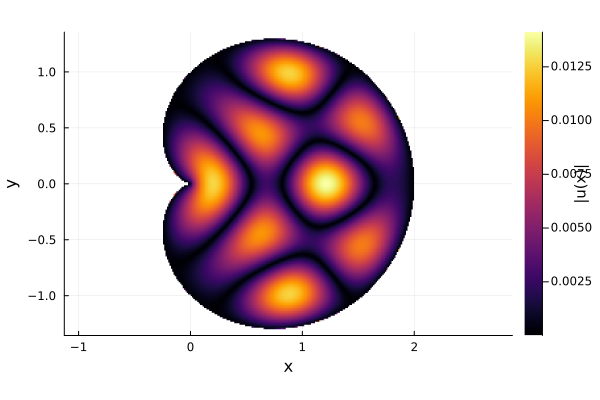

# Boundary Element Method for Quantum Billiards

Spectrum solver for 2D Helmholtz quantum billiard problems with Dirichlet boundary conditions. Implements a Nyström-based Boundary Element Method (BEM) to construct boundary data, assemble boundary integral operators, and scan wavenumbers to approximate resonant modes. Includes wavefunction visualisation and spectral analysis tools. 

This is a refined version of code originally developed for my master's project (text found in rsc/). It's still a good companion to this repo as the methods are identical, and it provides a comprehensive introduction to the theory involved.

## Overview
Quantum billiards describe particles confined in a 2D region with perfectly reflecting walls. The dynamics of these systems are described by the Helmholtz equation under Dirichlet boundary conditions
```math
(\nabla^2 + k^2)\psi = 0, \quad \psi|_{\partial \Omega} = 0.
```
This equation gives rise to resonant eigenfrequencies $k_i$ which correspond to the energy spectrum of the system ($E_i=k_i^2$). This project applies a **Boundary Element Method (BEM)** to convert this equation into the **Boundary Integral Equation**
```math
\frac{1}{2}\frac{\partial \psi}{\partial \mathbf{n}}(r_{x}) = \int_{\partial\Omega} \frac{\partial G(r_{x},r_{y})}{\partial \mathbf{n}_{x}} \frac{\partial \psi}{\partial \mathbf{n}}(r_{y})  \; \mathrm{d}s_{y},
```
where 
```math
G_{k}(\mathbf{r}, \mathbf{r'}) = \frac{i}{4} H_{0}^{(1)}(k|\mathbf{r}- \mathbf{r'}|).
```
is the 2D free-space Green’s function. This equation is approximated to a matrix equation of the form $A\phi = 0$, where $\phi = \frac{\partial \psi}{\partial r}$, using the Nyström quadrature method. Solutions are deduced by scanning across a range of $k$ and detecting singularities in the boundary operator $A$ via **SVD minima**. Evaluating at individual resonant modes and solving for $\frac{\partial \psi}{\partial r}$ along the boundary allows us to reconstruct physically relevant wavefunction solutions $\psi$ on the billiard as seen below. More generally, evaluating the spacing (Wigner-Dyson) statistics of the spectra of billiard systems allows us to draw parallels between classical and quantum notions of chaos. 

## Features

- ✅ Boundary element discretisation of the 2D Helmholtz equation 
- ✅ Multithreaded BEM matrix assembly
- ✅ Optimised Kernel function via Hankel function tabulation
- ✅ Iterative hot-loop Krylov method for fast resonance scanning via singular value analysis
- ✅ Visualisation of wavefunctions inside the billiard  
- ✅ Spectrum unfolding using Weyl’s law  
- ✅ Spacing distribution and spectral statistics analysis  
- ✅ Support for circle, square, rectangle, cardioid, and Bunimovitch stadium geometries

## Directory Structure
- BEM/
    - Mesh/ -- boundary and mesh data construction
    - Kernel.jl -- kernel function
    - Matrix.jl -- matrix operator constuction
    - Resonances.jl -- resonant mode detection
    - Solver. jl -- boundary data and wavefunction solver
    - Optimisations/ 
        - Hankel.jl -- Hankel function tabulation
        - SingularValues.jl -- Krylov iteration-based min svg finder
- Spectral/
    - Weyl.jl -- spectrum unfolding and counting function
    - WignerDyson.jl -- level spacing statistics
- Visualisation/
    - BilliardVis.jl -- stationary solutions
    - SpacingVis.jl -- level spacing statistics
    - WeylComp.jl -- comparison to weyl prediction
    - BoundaryVis.jl -- boundary data 


## Installation

This package can be installed from Github using the the command:
```julia
using Pkg
Pkg.add(url="https://github.com/MatthewScargill/QuantumBilliards.jl")
```

## Quickstart example
```julia
using QuantumBilliards

# Set the number of boundary discretization points
N = 700  

# Extract nodes, normals, weights, and billiard geometry data using a _info function
xs, ns, w, geom_data = QuantumBilliards.cardioid_info(N)

# Find resonant modes between 1 and 15, evaluated at 2000 interim points
spectrum = QuantumBilliards.resonant_modes(1.0, 15.0, 2000, xs, ns, w)

# Isolate a resonant mode and produce the associated bound state solution on the billiard
test_res = spectrum[7] # picking the seventh mode
QuantumBilliards.plot_billiard(xs, ns, w, test_res)
```



(a markdown document showing a more complete example workflow with basic explanations can be found in rsc/)

-----
Questions, extensions, and research discussions are welcome.
