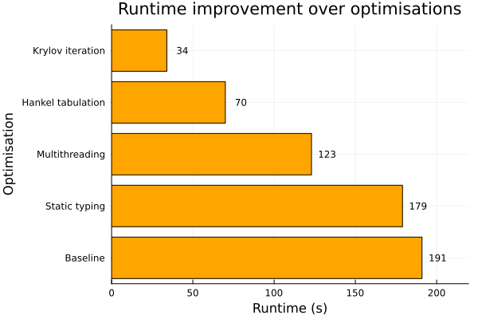

# Runtime optimisation overview 

The aim of this optimisation work was to reduce the overall runtime of the computation pipeline while preserving numerical accuracy. The baseline implementation prioritised clarity over performance, and relied heavily on dynamic dispatch and recomputed several intermediate quantities, resulting in unnecessary overhead. 

## Summary of improvements

- Static typing: Introducing type annotations and ensuring type stability eliminated dynamic dispatch inside the performance-critical regions. Julia’s compiler was therefore able to generate more efficient machine code, reducing overhead and providing a substantial speedup essentially “for free”.
- Multithreading: Independent iterations of the computation were parallelised using Julia’s multithreading capabilities. Given the very parallel nature of matrix construction, distributing it across available CPU cores resulted in massive speed gains.
- Hankel tabulation: The kernel function relied on an expensive Hankel function for most matrix entries, leading to many values being recomputed within each matrix. Since multiple matrices were being computed over the same geometry, it made sense to cache these values in a lookup table. This lead to significantly reduced redundant work, especially for large parameter sweeps.
- Krylov Iteration: The original implementation relied on a direct solver, which became increasingly costly for larger system sizes. Replacing it with a Krylov subspace iterative method dramatically improved efficiency, especially when combined with the improvements above.

## Runtime comparison

Here, a resonance scan between k = 1 and k = 15 was carried out on a cardioid billiard of 400 nodes across the range of project versions. Each improvement builds upon the previous.

Hankel tabulation and Krylov iteration had the largest impacts, reducing runtime from the previous versions by 43 and 51% respectively. All in all, a runtime reduction of around 82% was reached.

## Reflection and future work

Several avenues exist for further optimisation:

- GPU acceleration of the linear algebra components
- More sophisticated caching strategies for repeated evaluations
- Adaptive precision to reduce unnecessary floating-point overhead
- Additional profiling-guided refactoring

These improvements were left for future iterations since the current runtime is already sufficient for the intended use cases. 